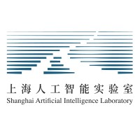

# 📖 Educations
- *2022.09 - 2025.06*, Master, Institute of Computing Technology, Chinese Academy of Sciences, Beijing, China. 
- *2018.09 - 2022.06*, Undergraduate, College of Science, Zhejiang University of Technology, Hangzhou, China.

# 💻 Internships
- *2024.03 - present*:  Research Intern at Institute for Intelligent Computing, Alibaba Group, Beijing, China

- *2023.09 - 2024.02*:  Research Intern at Shanghai AI Lab, Shanghai, China

- *2023.03 - 2023.08*:  Research Intern at MeetYou AI Lab, Beijing, China